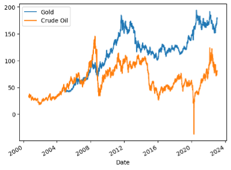
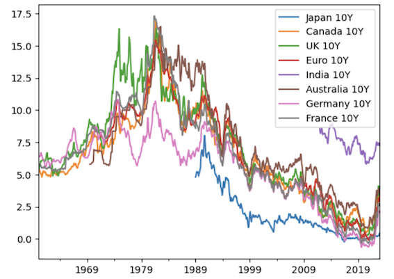

 <dir align="center">  Hedging in a Bear Market 

<dir align="left">

### Project 1 Group 2 Contributors:
* Aakshay Gautam
* Emmanuel Joseph
* Jennifer Kerr
* Rei Dema
* Tarun Midha
  
## **Hypothesis**
In our presentation today, we are going to be comparing the different asset classes i.e., Gold, Crude Oil, and the US House Pricing Index against the 10-year t-bills of the major world economies, which are generally conservative investments in a bear market. We will also be using Bitcoin as an asset class to study the trends of the cryptocurrencies during bear markets.

## **Executive Summary**

Over the last two years, our lives changed in ways we've never seen before and hopefully will never see again.  Between stay-at-home orders, record housing prices, market highs and lows our lives will never be the same.  We have also seen technology rapidly advancing and the fintech industry expanding.  As we come out of this period, we are seeing high rates of inflation and signs are showing that we may be heading into a recession.  With this in mind, investors are looking for ways to hedge in a Bull Market and potentially a Recession.
  
## **Concept**
We wanted to compare the relationships among different asset classes over a period of time to see if any of them seem to hedge the market during downturns.  The classes that we decided to evaluate are:
* 10-Year Treasury Bonds from different counties
* BITCOIN
* Gold 
* Crude Oil 
* US House Pricing Index

For the 10-Year Treasury Bonds, we wanted to look at various countries who had various economic and political differences to see how they trended.  Based on available data and research, we chose to use the following countries:
<pre>
* USA            * UK            * China             * India
* Japan          * EU            * Brazil            * South Africa
* Egypt          * Nigeria       * Australia         * Germany
* Canada         * France        * Russia
</pre>
We decided to use various graphs to plot the daily changes in the price of 10Y T-Bills, daily changes in the price of Bitcoin, daily changes in the prices of gold, daily changes in the prices of crude oil and the changes in US House Pricing Index.

## **Data Collection and Clean-Up**
We used various data sources including Fred, investing.com, alpaca, and yfinance. While gathering the data, we realized that some data was available daily whereas other was only available monthly. Because of this, we had to clean the data to ensure that we were consistent and able to compare the data.

We also used various Python packages to help us get, clean, and analyze the data. These packages include:

* pandas
* Path
* fredapi
* alpaca_trade
* alfa_vantage
* yfinance 
* fredapi
* bokeh
* seaborn

By combining these various packages and using them together, we were able to import all our required data, clean the data, analyze the data and create graphs and charts to help tell our story.

## **Analysis**
With all the data available, we looked to answer a few key quesitons using python analysis and graphs.

### Question 1:
**How does Bitcoin perform as a hedge during bear markets when compared to the US 10 year T-Bills?**  
We analyzed the data for the monthly price changes for BTC and the 10-year T-Bills for all the major world economies selected. After taking this month-over-month data and compiling it, we placed the data on a graph to study the trends and relationship between the two, focusing on the times a bear market is in session.

***We can see in the graph above that BTC returns vs 10 yr US t-bill returns moved in different directions (bitcoin having much higher volatility) up until 2020.*** Around 2020 when bitcoin gained footing as a major part of the economy. This came about due to BTC's massive increase in price, popularity, and consumer confidence. From this, we can see that up until 2020 BTC and US T-bills were a good combo to hedge against one another. However, ***as BTC gained popularity and because a large player in the market, we see that it is now moving with the market.*** We see that as the US T-bill rate swung massively in 2020 and devalued bonds by large amounts the BTC returns immediately dropped. The reason being is that large corporations and big players started to purchase BTC and those big players were also affected by t-bill rates as they are most likely owners of debt in the form of bonds. As the interest on the bonds increases had you been in possession of BTC you would need to liquidate your BTC in order to support your bond loan debt. As a result, ***the two began to move together and we see a decrease in the price of BTC as sell-offs occur in order to keep up with the increasing debt expense. So in conclusion, hedging strategies ideally will help to provide more liquidity during a bear market.***

### Question 2:
**Does Gold really act as a hedge during bear markets or are there better alternatives to gold as an asset class during times of economic turmoil?**

We looked at the monthly price changes in gold and compared it with the performance of the 10 year T-Bills for selected  major world economies, crude oil, Bitcoin, and the US House Pricing index. After taking all the month over month data and compiling it, we plotted the data on a graph to study the trends and analyze the difference in the performance of gold versus all other asset classes chosen and ascertain if gold really is the best hedge during times of economic turmoil.

**Gold vs 10 yr US T-Bills:** Studying the trends and correlation between gold and 10-year US Treasury bills, we can see that there is a ***notable correlation between the two asset classes.*** The US T-Bills outperform gold till 2008 after which gold takes a massive lead in the performance against US 10 yr t-bills. We can see that the performance of the 2 asset classes is positively correlated with each other but we can not say that the correlation is consistent. The market for both assets moves in a similar manner from 2015 till 2020 when we note a massive surge in the prices for both assets, followed by a complete reversal for the US T-bills while gold continues to outperform the t-bills, with the gap in price indexes growing wider. ***After carefully analyzing the trends of the 2 asset classes, we can conclude that gold is a better hedge than the US 10-year T-Bills during times of economic turmoil.***
  

**Gold vs Crude Oil:** Gold became a strong asset class after the economic recession of 2008. Crude oil outperformed gold till 2008 and it gained a major advantage against gold during the time immediately following the 2008 financial crisis, after which it nose-dived. The prices of the two asset classes move in the same direction, with varying volatilities, from 2009 to 2020. ***After careful analysis of the trends, we can conclude that the performance of two asset classes is negatively correlated during periods of economic turmoil and that in the long run, gold is a better hedge against crude oil whereas, crude oil is a very good short term investment with massive returns during times of economic uncertainty.*** For example, if a company were to buy crude oil before the onset of economically unstable periods, and hold it to sell during the market recovery period, the company could make phenomenal returns on its short-term investment.
  

**Gold vs S&P 500 Index:** After analyzing the trends and relation between the performance of gold and the S&P 500 Index against each other, we note that ***gold only outperformed the stock market for a brief period from 2010 to 2013*** after which the stock market has been consistently growing positively whereas the prices of gold have been stuck in the same price range (more or less). We can see that in times of economic uncertainty i.e., 2008 and 2020, there was a ***negative correlation in the prices of the two assets*** with the stock market taking a huge dump while gold prices increased. ***After careful analysis, we can conclude that the S&P 500 Index is a way better asset class to invest, against gold, in the long run as we can see that the gap difference in prices of the two asset classes has been increasing tremendously over the years. To be noted: Gold is a good hedge against the S&P 500 during times of economic uncertainty because as the prices of S&P 500 Index decrease, the prices of gold move in an opposite direction and increase.***

  

**Gold vs BTC:** There is not a lot of data to compare these two asset classes for a complete analysis since bitcoin only really came into the picture of being recognized as a viable investment class after 2016. Upon analyzing the trends of gold and bitcoin, also known as e-gold, we can see that as the price of gold increased in 2016, so does the price of bitcoin and as the prices of gold surged in 2020, so did the prices of Bitcoin. It would not be wrong to conclude that both asset classes are positively correlated with varying volatilities. The prices of e-gold are very volatile as compared to the prices of gold. ***After careful analysis, we can say that during times of economic turmoil, gold is a better asset class to invest in for risk-averse investors whereas Bitcoin is a better asset class for risk-loving investors.***
  
  

**Gold vs the US House Pricing Index:** Upon studying the trends of performance of gold versus the US House Pricing Index, we can conclude that gold is a better asset class to invest in fairly easily. We can note that the chart line for the US House Price Index is more or less confined within the same range and there is no major volatility in the prices of houses in the US, except for 2008. On the other hand, we can note that the price volatility in gold is fairly high and that the prices increased exponentially after the 2008 recession. In my opinion, ***Gold is a better asset class to invest in against the average US House Pricing Index during times of economic uncertainty but it might be more lucrative to buy houses and properties in places where one would expect a higher ROI during tough times because property prices vary throughout the US due to various factors.***

  

### Question 3:
**Is there a correlation between the prices of Bitcoin and 10-year T-Bills?**

We looked at the data for the monthly price changes to BTC and the 10-year T-Bills for all the major world economies selected. After taking this month-over-month data and compiling it, we plotted the data on a graph and studied the trends and relationship between the prices of the 10-year T-Bills and Bitcoin to ascertain if there is a correlation between them.
  

We determined that, yes, there is a correlation between the prices of the 10-year t-bills and the price of bitcoin. We can see that up until 2020 US t-bills rate and price and the price of BTC did not have such a strong correlation up until that point because the 10-year t-bill rate has been consistent as the rate on 10-year US t-bills had not moved very much. But we can see that as bitcoin started to gain footing in 2020 as a major mover and t-bill rate volatility has increased we can see that the two start to have more and more of a correlation in terms of price. As bonds have an inverse price/rate relationship we can see the returns table showing an increased rate(decreased bond price) at the same time BTC returns decline. This indicates a correlation between the two as they are moving at the time towards having a negative impact on a portfolio at the same time. As your bond rate increases your bond price decreases and at the same time your BTC price decreases.

The same thing will be the case for most developed nations around the world as all of the major developed nations' monetary policy-setting institutions such as the federal reserve in the USA or Bank of Canada will work together in rate targeting and move bond prices together in order to drive the world economy as a whole. So as a result you will see a correlation in prices of 10-year t-bills from developed countries also moving the same way as bitcoin prices as we can see the same response in bond rate hikes further devaluing the prices of their bonds in countries like the UK, Germany, Australia, France.

For developing nations such as Brazil, we can see that the t-bill rate is very volatile as a result of economic uncertainty so for those countries there tends to be no correlation between the price of bitcoin and t-bill rates.

So for major developed nations, there is a correlation between the price of BTC and the price of 10-year t-bills but that is not the case for developing nations with much higher t-bill rate volatility.

### Question 4:
**How are the prices of Bitcoin affected as the institutionalized cost of borrowing increases?**

As we can see from the graph depicting returns of BTC vs returns of the 10-year US t-bill rate up until 2020 the price of bitcoin was not impacted very much as the cost of borrowing (t-bill rates) had been moving. As the 10-year US t-bill started to drastically increase though in 2020 we see a big negative impact on the returns of BTC and in turn the price. The reason for this is that by 2020 with BTC having established and becoming a major part of the market it started to mirror and behave similarly to the equity market which we can see illustrated in the graph showing s and p 500 vs gold. As the equity market took a tumble so did the price of BTC. Typically the bond and equity markets do not move down at the same time. In 2020 what we saw is that because of increasing interest rates colliding with multiple factors such as the effects of covid on the market, tensions in Ukraine/Russia, and a general lack of faith in the economy the equity market was going down at the same time as the bond market was losing steam. As a result of bitcoin moving in the direction of equities at that time, it took a tumble at the same time the cost of borrowing was increasing. Typically now as Bitcoin becomes more and more rooted into the economy. It should begin to behave similarly to equities and remain unaffected by the institutionalized cost of borrowing increases. But At the given moment it is an atypical situation and as a result, we see bitcoin prices move down as the cost of borrowing increases.

### Question 5:
**Is there any correlation between any 3 asset classes during bear markets?**
  
Based on what we can see from the behavior of returns and prices between the asset classes there is a correlation between the different classes. In a typical economic environment, the 10-year bond yield and treasury prices typically would not have such a strong correlation to the commodity asset class (gold and oil) and also would not have a strong correlation with BTC prices. However, the 10-year bond yield is usually indicative of movements within the housing price index. The reason for this is that increases in the 10-year bond yield can push the feds to increase the overnight rate to the banks which in turn can affect lending rates which in turn will affect the housing price index. 
  Now what we can see from the data is that in the current rate environment from 2021 onward as the 10-year yield has been increasing there has been a direct effect on the housing price index which has decreased in the time that the bond yields have increased indicating that there is a correlation, we can also that in 2008-2012 around the time and post-2008 financial crisis the bond yields have a direct spike at the time that the housing price index had decreased. The commodity market and 10-year bond yield usually do not have a correlation as commodities behave separately from the equity and bond market. We can see Gold vs SP500 the two do not show strong movements of the same magnitude and direction. 
  Similarly, we can see that as the 10-year bond yield moved significantly in 2020-2021 oil had a very large dip but gold remained largely unaffected. Traditionally commodities do not correlate to the bond or equity market and as BTC has been closely related to both we can make a case that there is no correlation between BTC, the housing price index, or 10-year bond yield and the commodity market. As we can see a small relationship between BTC and the 10-year bond yield it is difficult to make an association between BTC and the housing price index at this point. The housing market cycle typically is about 15 years, BTC has been around only since 2009 it is unclear whether the two have a correlation. At the moment the effect of BTC and the bond yield are the closest link can make to BTC and the housing price index having an effect on one another.

### Question 6:
**What impact do hedging strategies have on the liquidity of markets during a bear market?**
  
Hedging strategies in a bear market should provide the portfolio with more liquidity. The idea is that in a bear market as confidence in the market is decreasing and as we see a decline in prices it becomes increasingly more difficult to take your securities to market and sell them. So by hedging, we are diversifying the risk of asset allocation across a number of portfolios. These asset allocations remain independent of one another across different classes so that during the market downturn your portfolio is not dependent on only one of the investment types declining. In our portfolio, we are looking at BTC(crypto), treasury bonds (fixed-income), gold/oil(commodity market), and the housing price index(real estate market). Due to the price of BTC, you cannot see it in the graph except around 2015-2016 when it began to take hold in the market.
  

When we look at gold vs the US T-bills vs cash vs crude oil from 2000-2024 we can see that in 2008 as oil and gold were taking a big dip, the t-bill market was fairly consistent and although bond yield had slightly increased resulting in a drop in bond prices, the dip in bond prices would not have been as significant as the dip in the oil price. As a result at that time if you were to be in need of liquidity by taking both your bonds and oil to market - in case no one was buying your oil you could still sell some of your bonds or gold for that matter as a way to provide yourself some liquidity relief while maintaining your oil position giving it time to recover and not having to dump it off at an extremely low price. We see similar behavior with crude oil in 2020 and an even more drastic dip in oil vs the increase in bond yield and gold as we can see hedging your oil in 2020 was a very smart move as the oil market had dipped so low and bounced back to such a high that had you been in need of cash when oil dipped and you had to liquidate your investments at such an all-time low you would have missed the opportunity for oil to skyrocket in its recovery period as we can see in 2021-2022 onward.
  
  
## **Links**
### Data Links
Bitcoin: https://fred.stlouisfed.org/series/CBBTCUSD  
US House Price Index: https://fred.stlouisfed.org/series/USSTHPI   
Various 10-Year T-Bond Returns: https://fred.stlouisfed.org  
Various 10-Year T-Bond Returns: https://ca.investing.com/
